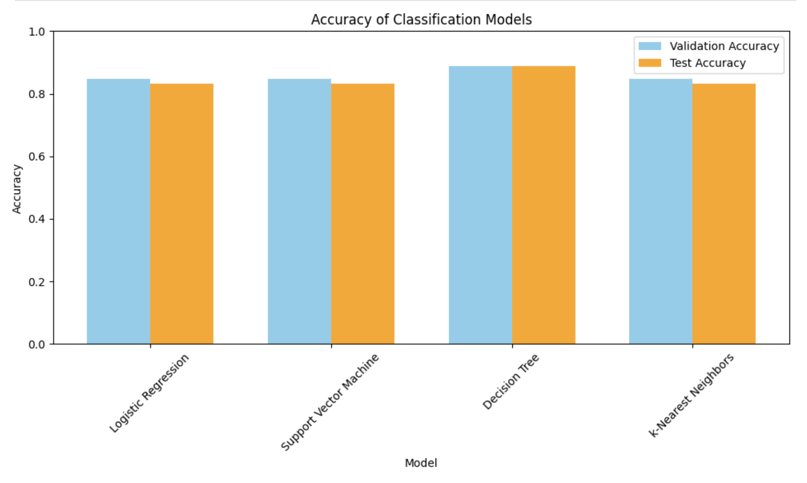
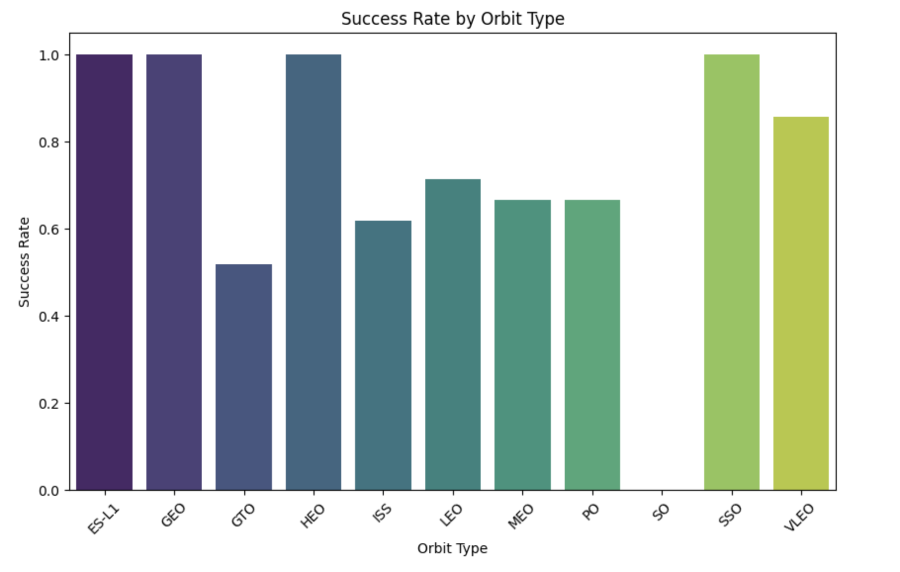
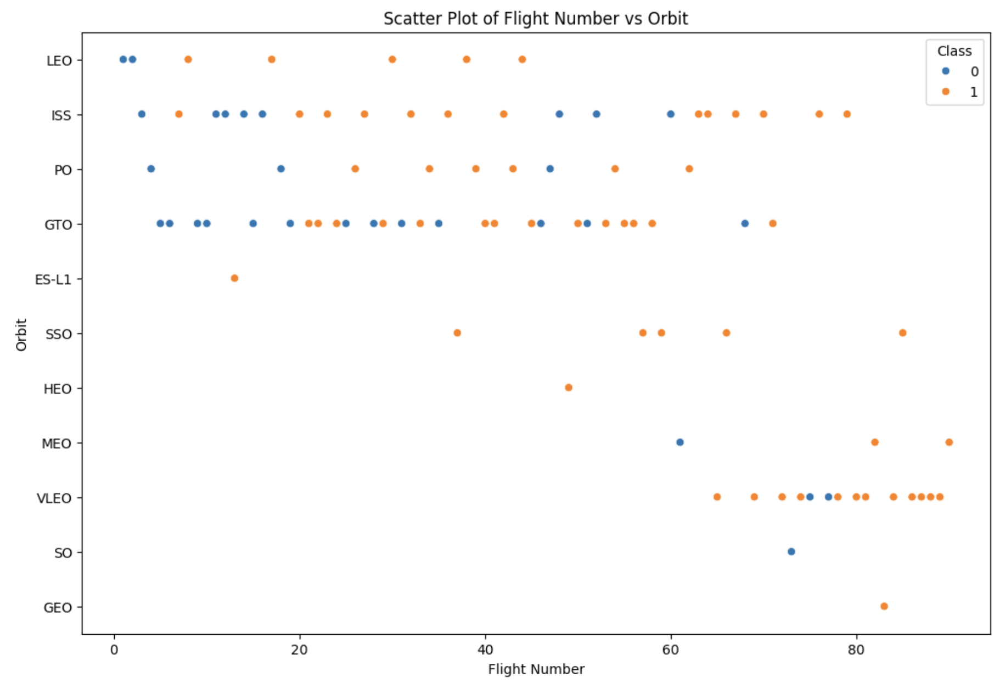

## 🚀 SpaceX Falcon 9 First Stage Landing Prediction

This repository contains a complete machine learning pipeline for predicting the successful landing of the first stage of SpaceX's Falcon 9 rockets. By analyzing historical launch data, the project aims to build a classification model capable of forecasting landing outcomes based on mission parameters.

---

## 📌 Introduction

SpaceX significantly reduces launch costs by reusing the first stage of its Falcon 9 rockets. Predicting whether a first stage will land successfully is crucial for understanding mission risk and estimating launch costs.

This project uses real-world launch data—including features such as orbit type, payload mass, flight number, and launch site—to train a supervised machine learning model. The goal is to classify whether a launch's first stage will successfully land (`1`) or not (`0`), based on its input features.

---

## 💡 Motivation

Each Falcon 9 launch represents millions of dollars in investment. Accurate prediction of first-stage recovery outcomes allows companies, analysts, and engineers to make informed decisions about mission planning, risk assessment, and reusability potential.

By applying machine learning techniques to SpaceX’s launch records, this project demonstrates how data science can support space innovation and operational efficiency. It also serves as an educational example of building a real-world classification pipeline from EDA to model evaluation.

---

## 📊 Key Visualisations

### 1. Accuracy Comparison of Models

This bar chart displays both validation and test accuracy for four classification models:



> The models included in this comparison are:
- Logistic Regression
- Support Vector Machine (SVM)
- Decision Tree
- K-Nearest Neighbors (KNN)

> As seen above, the **Decision Tree** model achieved the highest accuracy on both validation and test sets, suggesting better generalisability and predictive power.

### 2. Accuracy Scores Table

| Model                  | Validation Accuracy | Test Accuracy |
|------------------------|---------------------|---------------|
| Logistic Regression    | 0.8464              | 0.8333        |
| Support Vector Machine | 0.8482              | 0.8333        |
| Decision Tree          | **0.8893**          | **0.8889**    |
| K–Nearest Neighbor     | 0.8482              | 0.8333        |

The **Decision Tree** classifier performed best, with both the highest validation and test accuracy, making it the most robust model in this analysis.

---

### 🔹 3. Success Rate by Orbit Type

This chart shows the success rate of missions by orbit type.  
Orbits such as GEO, HEO, and SSO achieved a **100% success rate**, while others like GTO and ISS have lower reliability.



---

### 🔹 4. Flight Number vs Orbit Type (Class Outcome)

The scatter plot visualises flight numbers across different orbit types, color-coded by class (success or failure).  
This helps identify trends or irregularities in outcomes based on flight order and orbit type.



## 🤖 Models Used

- Logistic Regression  
- Support Vector Machine (SVM)  
- Decision Tree  
- K-Nearest Neighbors (KNN)  

Each model was trained using cross-validation and evaluated using accuracy metrics on both validation and test datasets.

---

## 📂 Files

- `model_comparison.ipynb` — Jupyter Notebook with all code for preprocessing, model training, validation, and visualisation.  
- `bar_chart.png` — Visualisation comparing validation and test accuracy across models.  
- `README.md` — Project summary and usage instructions.

---

## ▶️ How to Run the Code

1. Open the `model_comparison.ipynb` file using Jupyter Notebook or JupyterLab.
2. Run all cells in the notebook to:
   - Preprocess the dataset
   - Train and validate each model
   - Compare accuracy results
   - Display summary tables and charts
3. Make sure you have the required packages installed. You can install them using:

   ```bash
   pip install pandas numpy matplotlib scikit-learn
